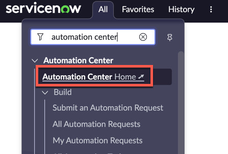
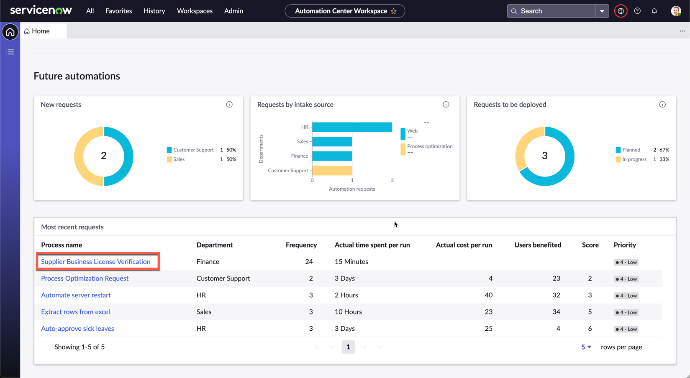
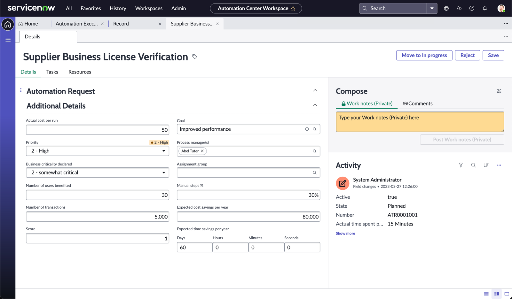
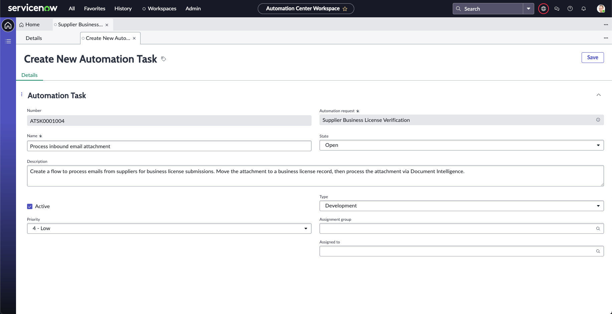
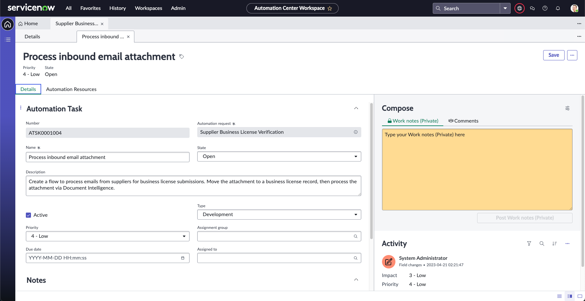
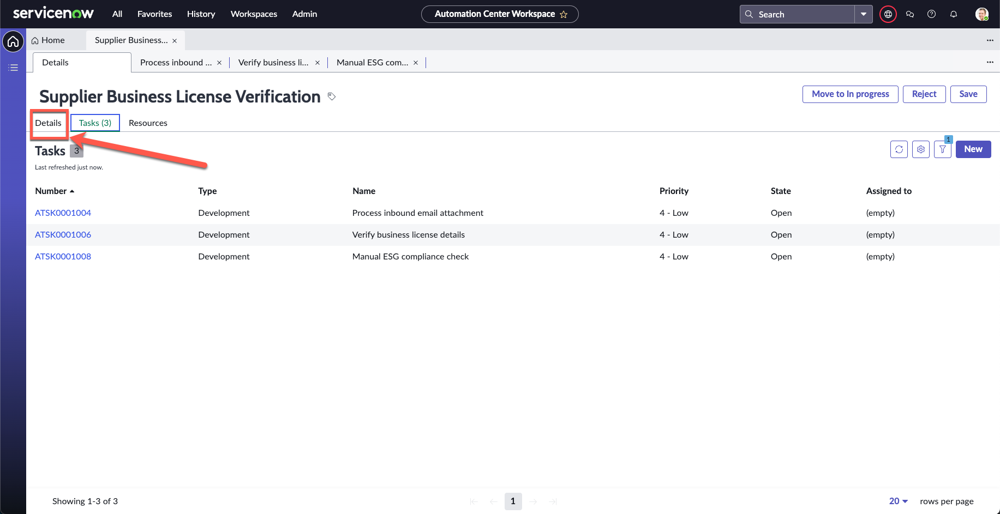

# Exercise 1: Automation Center (10mins)

We start off by understanding how this automation request was submitted. One of your colleagues within the Supplier Management function in Finance went to the Employee Center to submit an Automation Request. You can see how the form was filled and submitted in the image below.

## Starting work on the request

Automation Center enables organizations to discover, prioritize, and manage automation requests from different sources through the full life cycle in a single workspace. Let's progress this automation request.

1. Under **All**, search and navigate to **Automation Center Home**

    

1. Click on the date range, then select **YTD**, this will filter the data to update widgets

    

    >Note: These are all demo data and might not be up to date. In a production instance, these will be tracked in real time across all onboarded automation tools

1. Take a short moment to look around and orientate yourself with the Automation Center workspace

1. Scroll to the bottom and review the **Most recent requests** section

1. You will see the list of automation requests from the business. Click **Supplier Business License Verification** (this was the request raised by the Supplier Management team seen earlier)

    

1. Review the record. You will notice that there two different sections

1. The **Automation Request** section are the details that were created from the business user

1. The second section, **Additional Details**, contain the information to derive the financial impact of the planned automation to implement, and will cascade down to different metrics we see on the home page

1. Assume that you have already interviewed the supplier management team, and these are the value projections. You now have a way to track the success of this automation as it is deployed and in use

1. Click **Tasks**

    

1. On the **Tasks** tab, click **New** on the top right of the list, we will now add the automations we will be building

1. On the **Create New Automation Task** form, enter the following details

    | Field | Value 
    | - | ----------- 
    | Name | Process inbound email attachment 
    | Description | Create a flow to process emails from suppliers for business license submissions. Move the attachment to a business license record, then process the attachment via Document Intelligence.
    | Type | Development

    

1. Click **Save**

1. You should now see the Automation Task record. Don't worry about assigning this task as you are the one who will be doing everything today!

    

1. Click the **Details** tab

1. Create another new Automation Task using the steps above

    | Field | Value 
    | - | ----------- 
    | Name | Verify business license details 
    | Description | Create a custom API that will lookup the license registry database to verify the details of the supplier's business license
    | Type | Development

1. Click the **Details** tab

1. Create a final Automation Task using the steps above

    | Field | Value 
    | - | ----------- 
    | Name | Manual ESG compliance check
    | Description | Create a custom playbook action via Process Automation Designer to handle the manual ESG compliance check
    | Type | Development

1. Your list should have 3 automation tasks

1. Click the **Details** tab

    

1. Click **Move to In progress** on the top right of the form.

    

That's it for exercise 1! Automation Center will now be your hyperautomation dashboard to track and measure all automation activities within Nintech Co. You should be using it to track the statuses of all your automation tasks throughout this lab. Now let's get to the actual tools used to automate this process and deliver on the request.

### ***You can now add Automation Center to your Hyperautomation toolbox.***

[Next exercise](https://servicenowsaurabh.github.io/fpa/Exercise%202.html){: .btn .btn-purple }