# Exercise 4: Process Automation Designer

Even with automation, there are still activities that the Supplier Management team has to manually oversee which cannot be avoided. One of these processes is to check the ESG compliance of suppliers. In this exercise, we will be building on top of a playbook to assign a task to the ESG compliance team so that a suppliers commitments are tracked and accounted for.

Playbooks allow users to interact with a business workflow in real time from within Workspace. Users can utilize Playbook to update records, upload attachments, and complete tasks across multiple workflow activities in line.

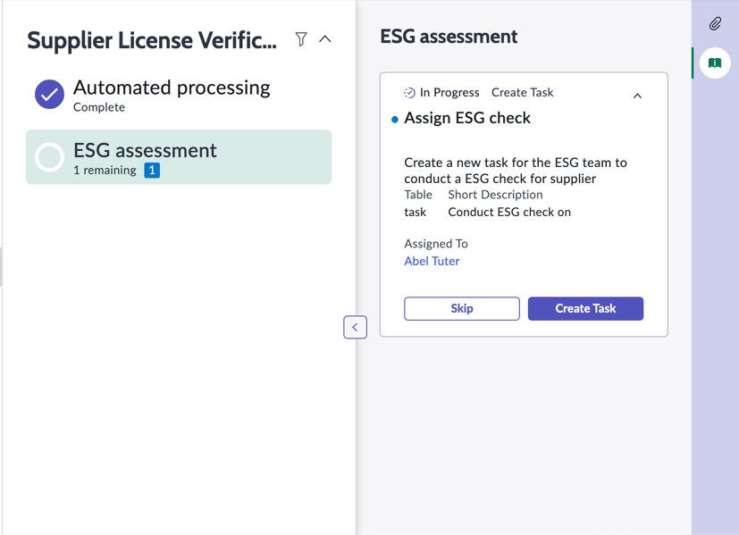

## Building in Process Automation Designer

1. Navigate back to the main ServiceNow UI

1. Under **All**, search and navigate to **Process Automation Designer**

    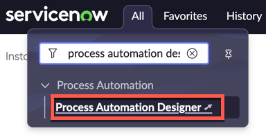

1. In the **Multi-flow processes** list, click **Supplier License Verification**

    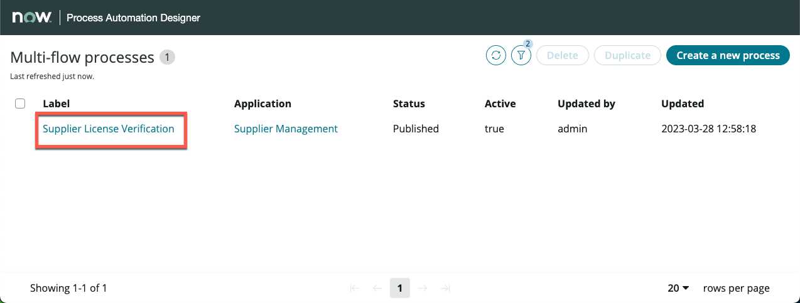

    > Note: For this lab, we have already implemented placeholder instructions based on the previous exercises. This is meant to be a quick start to add a new activity.

1. On a new column, click **Add lane**

1. On the right pop-up sidebar, enter **ESG assessment** under **Label** (2)

1. Enter **ESG assessment activities to be processed** under **Description** (2)

1. Click **Save** (3)

    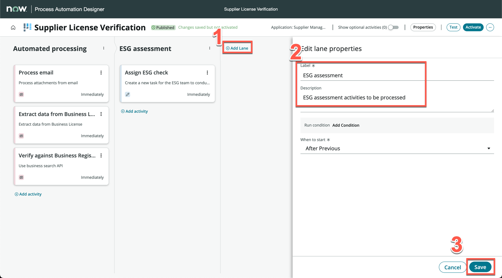

1. Under the newly created **ESG assessment** lane, click **Add an activity**

1. In the pop-up, search **wait for condition**, and click **Wait For Condition** under **Common Activities**

1. On the right side bar, change **Label** to **Verification complete** (1), then enter description **License verification complete** (2)

1. Click **Automation** (3)

    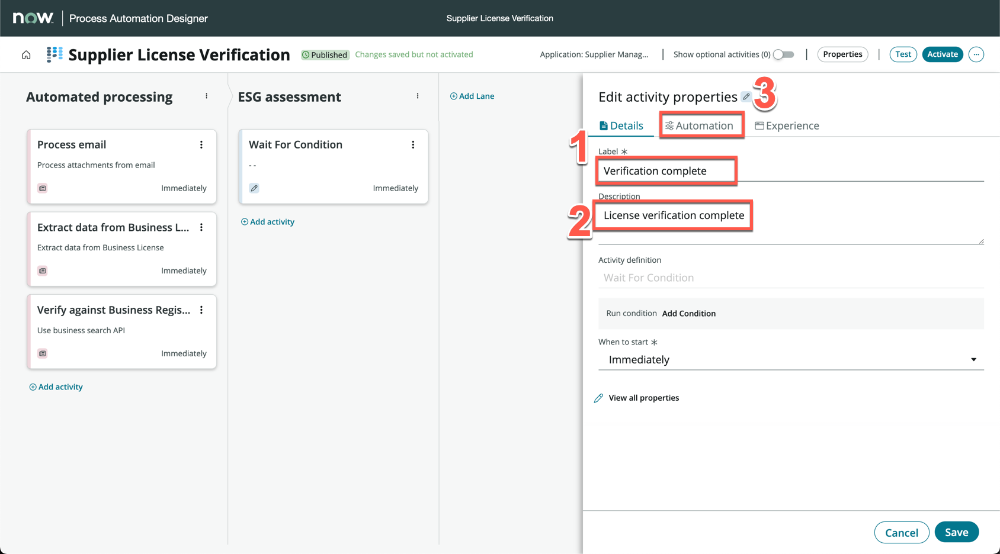

1. On the **Record** field, click the data pill picker (1), expand **Trigger - Business License** (2), click **Business License Record** (3)

    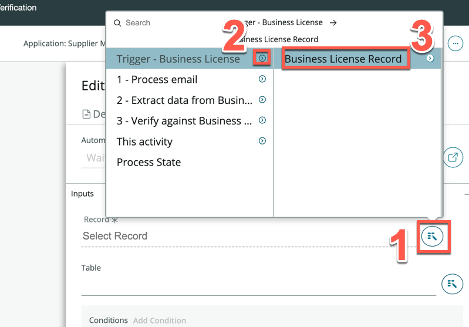

1. Click **Add Condition**

    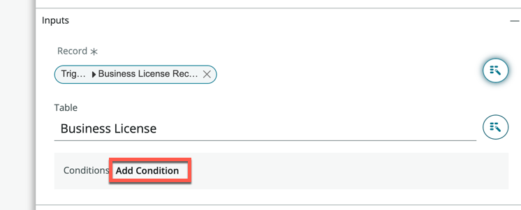

1. On the Modify conditions pop-up, set **Registry verified** to **is true**

1. Click **Modify**

    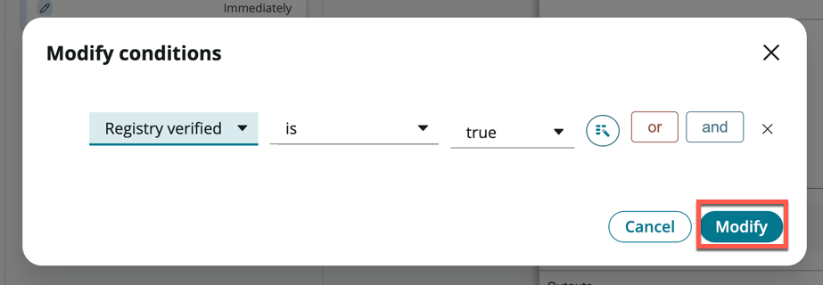

1. Click **Save**

1. Click **Add activity** under the **Verification complete** card

1. In the pop-up, search **create task**, and click **Create Task** under **Commmon Activities**

    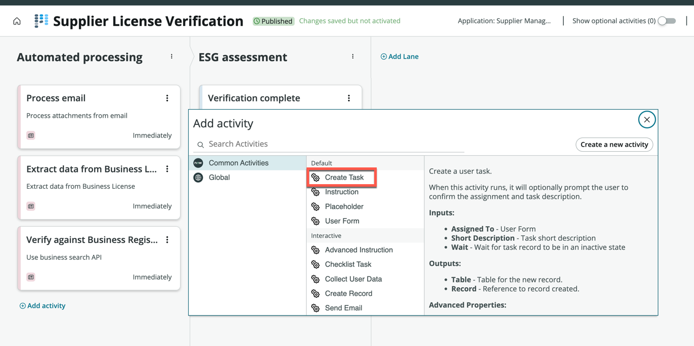

1. On the **Activity properties** side bar that appears, change the **Label** to **Assign ESG check**

1. Under **Description**, enter **Create a new task for the ESG team to conduct a ESG check for supplier** (1)

1. Click the **Automation** tab (2)

    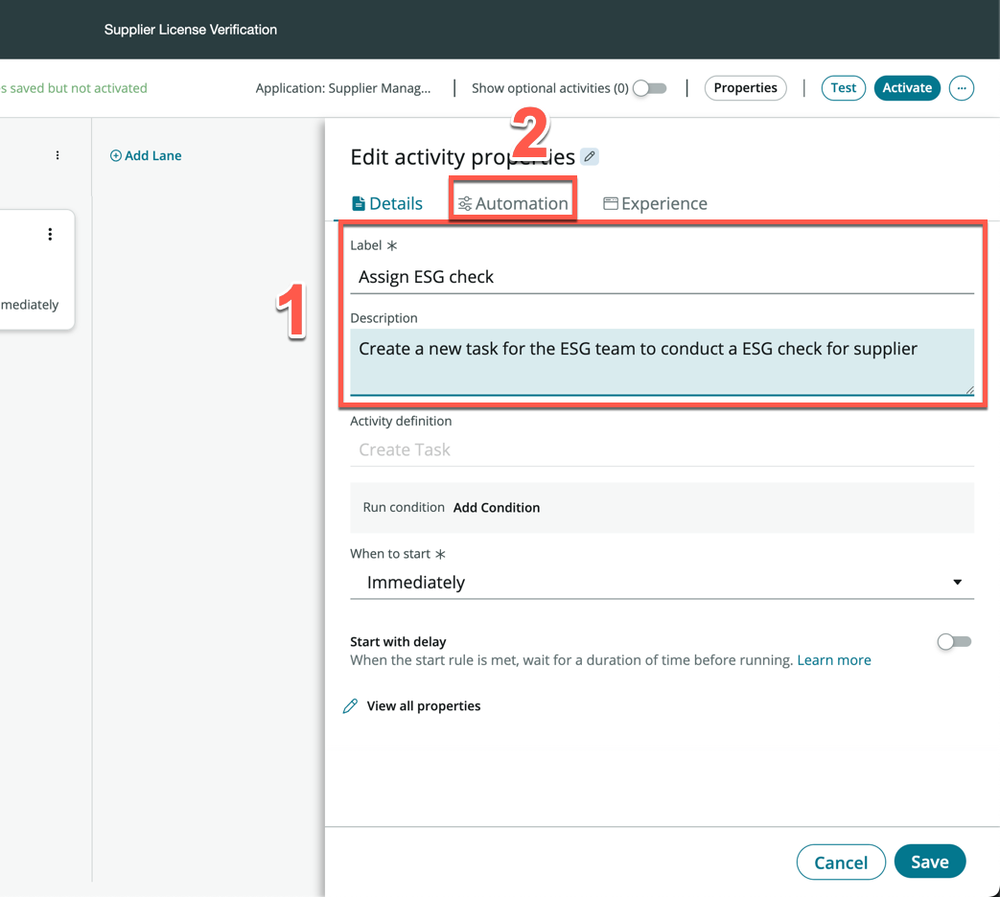

1. Under the **Inputs** section, select **Abel Tuter** under **Assigned To**

1. Under **Short Description**, enter **Conduct ESG check on -** (1), then click the data pill picker (2), expand **Trigger - Business License** (3), expand **Business License Record** (4), click **Business name** (5)

    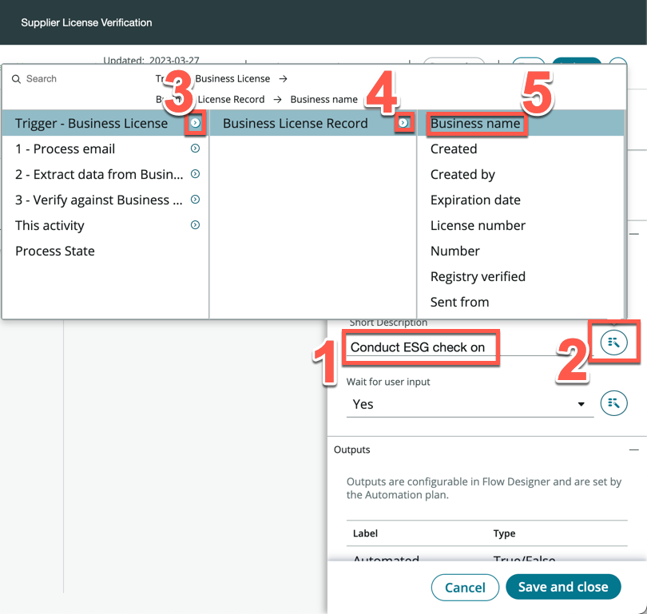

1. Your screen should look like the following

    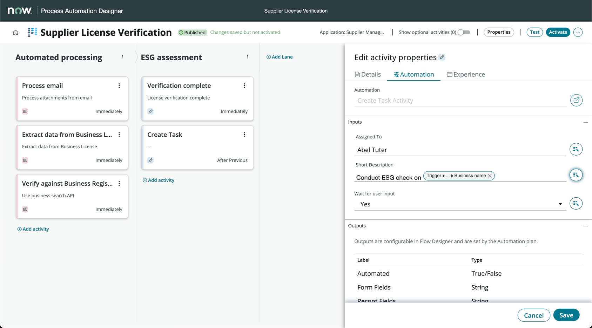

1. Click **Save** (1)

1. On the top right of the screen, click **Activate** (2)

    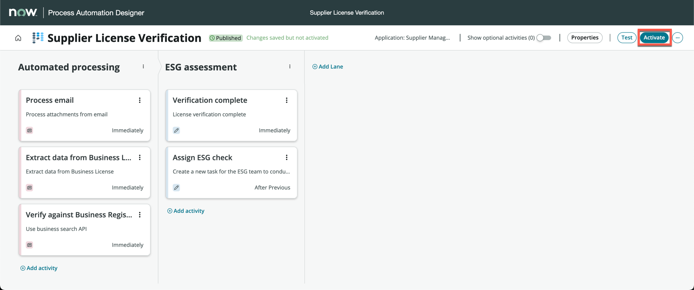

This exercise was purely illustrative on how you can go further and build playbooks on these process to accelerate the organization's automation agenda. Process Automation Designer is a highly powerful tool that can orchestrate your business processes and flows across stakeholders, departments and more.

[Previous exercise](https://shaoservicenow.github.io/hyperautomation/Exercise%203.html){: .btn .mr-4 }
[Next exercise](https://shaoservicenow.github.io/hyperautomation/Exercise%205.html){: .btn .btn-purple }